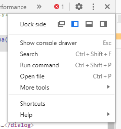

summary: Get a first approach to the Chrome DevTools and its different panels and functionalities
id: 1-the-basics
categories: Debugging
tags: devtools
status: Published 
authors: Alberto López-Barranco
Feedback Link: https://github.com/albelop

# 1- Chrome DevTools: The basics
<!-- ------------------------ -->

## Introduction
Duration: 1

Welcome to this series of codelabs about Chrome DevTools. In it we will deeply explore many of the functionalities that DevTools offer, from a basic level to more advanced topics like code execution, persisting changes or network analysis.
The codelabs are split in topics, normally related to each of the DevTools panels (Elements, Console, Sources...), which we will explore later on.

Positive
: "Chrome DevTools is a set of web developer tools built directly into the Google Chrome browser. DevTools can help you edit pages on-the-fly and diagnose problems quickly, which ultimately helps you build better websites, faster." [ChromeDevTools documentation](https://developers.google.com/web/tools/chrome-devtools)
 

<!-- ------------------------ -->

## Opening Chrome DevTools

There are many ways to access the Chrome DevTools when you are in a webpage:

- You can toggle the DevTools window on and off, by using either `F12` or `Ctrl+Shift+I`.
- Or go to `Chrome Menu (⋮)`  > `More tools` > `Developer Tools`.
- To directly access a DOM element in the Elements panel, right click on that element and select "Inspect".
- Or press `Ctrl+Shift+C` to select the element you want to inspect.

### Changing the layout

DevTools can either be opened in a separate window, or docked in the browser windows you are debugging. The settings menu shows the different docking options.

Positive
: Tip: Use `Ctrl+Shift+D` to restore last dock position.

<!-- ------------------------ -->

## Panels

### Elements panel

View and change the DOM and CSS

### Console panel
View messages and run JavaScript from the Console.

### Sources panel

Debug JavaScript, persist changes made in DevTools across page reloads, save and run snippets of JS, and save changes that you make in DevTools to disk.

### Network panel

View and debug network activity.

### Performance panel

Find ways to improve load and runtime performance.

### Memory panel

Profile memory usage and track down leaks.

### Application panel

Inspect all resources that are loaded, including databases, local and session storage, cookies, Application Cache, images, fonts, and stylesheets.

### Security panel

Debug mixed content issues, certificate problems, and more.

### Device mode

Though it is not exactly a panel, this mode lets you simulate mobile devices.

<!-- ------------------------ -->

## Command Menu

The command menu gives you quick access to most of the functionalities and configurations in Chrome DevTools. It also allows you to navigate through your project files and execute code snippets.

To open the Command Menu, press `Ctrl+Shift+P` or `Command+Shift+P` if you are using Mac. Also you can click `Customize And Control DevTools` and then select `Run command`.

### Possible actions

The first character in the command line defines the type of action you want to perform:

| Character | Action       |
| --------- | ------------ |
| >         | Run command  |
| ...       | Open file    |
| :         | Go to line   |
| @         | Go to symbol |
| !         | Run snippet  |

