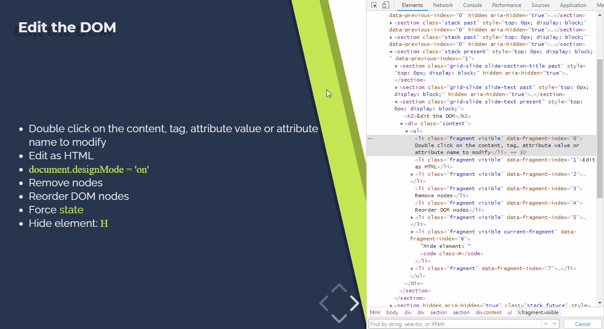

summary: Traverse, edit and analyze the DOM tree and CSS styles of your page
id: 2-dom-and-css
categories: Debugging
tags: devtools
status: Published 
authors: Alberto López-Barranco
Feedback Link: https://github.com/albelop

# 2- DOM & CSS

<!-- ------------------------ -->

## Traversing the DOM

Being able to navigate through the DOM and analyze all the nodes in your pages is one of the first things you need to know when you debug. Chrome DevTools offers several options to traverse the DOM and its elements in the Elements panel.

Use `Left click + Inspect` to inspect a specific node, or you can also use the Inspect button on the top left corner of the DevTools.

Positive
: Tip: When hovering over a node with the Inspect tool, a popover will show additional information, including the font, the color, and some a11y metrics.

You can traverse the DOM tree in the elemenst panel with the arrow keys. Use up and down to navigate between elements, and left and right to expand/collapse the nodes.

When you need to find a specific node use the search function with `Ctrl+F`. Search can be performed by string, by CSS selector or by XPath. 

Positive
: Tip: When the element you want to inspect is not visible in your window due to scrolling, select the node in the elements panel and use `Right click > Scroll into view` to move the scroll to that element.

<!-- ------------------------ -->

## Edit the DOM

Some times you need to make a quick change in your page texts, or reorganize the layout of the page to see which design fits better, just for testing or to take a screenshot. In those cases, the elements panel allows you to:

- Modify a node: `Double click` on the node's content, tag, attribute name or attribute value to update it.
- Edit as HTML: `Right click > Edit as HTMl` on a node to edit its full HTML content, including its children.
- Remove node: Simply press `Delete` to totally remove a node from the DOM.
- Reorder nodes: just drag and drop a node in the elements panel. Nodes can be moved in the same level, but also accross different levels/parents.
- Force state: `Right click > Force state` allows you to force some special states of the node like `:hover`, `:focus` or `:visited`. This is specially useful when you need to analyze a button or link behavior and styles.
- Hide an element: Press `H` on your keyboard to instantly hide the selected node from the DOM. You can use it to obscure sensitive information before taking a screenshot.

Negative
: ⚠ IMPORTANT: The modifications in the DOM tree inside the Elements panel are not persistant. Use it for testing purposes and then update your source code accordingly.

Positive
: Tip: Use `Ctrl+z` to undo any change you make in the Elements panel.

There is a special command that can be executed in the Console: `document.designMode = 'on'`. This will make all the text in your page editable, as if it was a WYSISIG editor. It has shortcuts for bold, italic... and even emojis!

Negative
: 👀 Try it yourself! Open the Chrome DevTools in this page and enable the designMode in the Console. You can now modify the contents.

<!-- ------------------------ -->

## CSS Reference

<!-- ------------------------ -->

## Animations