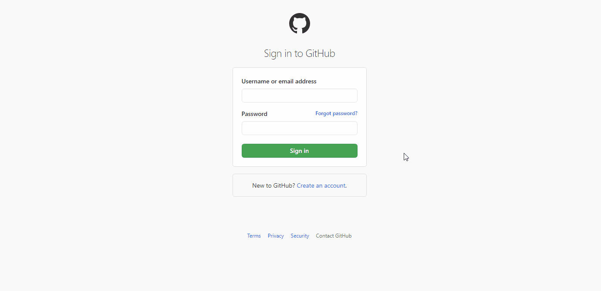

summary: Traverse, edit and analyze the DOM tree and CSS styles of your page
id: 2-dom-and-css
categories: Debugging
tags: devtools
status: Published 
authors: Alberto López-Barranco
Feedback Link: https://github.com/albelop

# 2) DOM & CSS

<!-- ------------------------ -->

## Traversing the DOM

Being able to navigate through the DOM and analyze all the nodes in your pages is one of the first things you need to know when you debug your page. Chrome DevTools offer several options to traverse the DOM and its elements in the Elements panel.

Use `Left click + Inspect` to inspect a specific node, or you can also use the Inspect button on the top left corner of the DevTools.

Positive
: **💡 Tip:** When hovering over a node with the Inspect tool, a popover will show additional information, including the font, the color, and some a11y metrics.

You can traverse the DOM tree in the elements panel with the arrow keys. Use up and down to navigate between elements, and left and right to expand/collapse the nodes.

When you need to find a specific node, use the search function with `Ctrl+F`. Search can be performed by string, by CSS selector or by XPath. 

Positive
: **💡 Tip:** When the element you want to inspect is not visible in your window due to scrolling, select the node in the elements panel and use `Right click > Scroll into view` to move the scroll to that element.

<!-- ------------------------ -->

## Edit the DOM

Some times you need to make a quick change in your page texts, or reorganize the layout of the page to see which design fits better, just for testing or to take a screenshot. In those cases, the elements panel allows you to:

- Modify a node: `Double click` on the node's content, tag, attribute name or attribute value to update it.
- Edit as HTML: `Right click > Edit as HTMl` on a node to edit its full HTML content, including its children.
- Remove node: Simply press `Delete` to totally remove a node from the DOM.
- Reorder nodes: just drag and drop a node in the elements panel. Nodes can be moved in the same level, but also accross different levels/parents.
- Force state: `Right click > Force state` allows you to force some special states of the node like `:hover`, `:focus` or `:visited`. This is specially useful when you need to analyze a button or link behavior and styles.
- Hide an element: Press `H` on your keyboard to instantly hide the selected node from the DOM. You can use it to obscure sensitive information before taking a screenshot.

Negative
: **⚠ WARNING**
The modifications in the DOM tree inside the Elements panel are not persistant. Use it for testing purposes and then update your source code accordingly if needed.

Positive
: **💡 Tip:** Use `Ctrl+z` to undo any change you make in the Elements panel.

There is a special command that can be executed in the Console: `document.designMode = 'on'`. This will make all the text in your page editable, as if it was a WYSISIG editor. It has shortcuts for bold, italic... and even emojis!
Disable the design mode with `document.designMode = 'off'`.

Negative
: **👁‍🗨 Try it yourself!**
Open the Chrome DevTools in this page and enable the designMode in the Console. You can now freely modify the contents. Take in account that all the event handlers (clicks, keypress...) are not disabled.

<!-- ------------------------ -->

## Getting stated with CSS 

In this section you will learn the basics of viewing and editing a page's CSS using Chrome DevTools.

### View an element's CSS

When you inspect a node with the Inspect tool, the **Styles tab** on the Elements panel will show the list of CSS rules being applied to the current node, grouped by selectors and files.
You can disable a CSS rule just by hovering over the rule and unticking the checkbox that is shown before the rule.

You can also change both the name of a rule or its value by clicking on it and typing the new name/value. Those rules that have a striketrough are either disabled or overriden by another rule with a greater precedence.

Negative
: **👁‍🗨 Try it yourself!**
Some CSS values, like color or shadow-box, have an interactive menu that allows quick and easy changes. Try changinf the background color of this info alert.

Positive
: **💡 Tip:** Search for **Panel layout** in the **Command Panel** to alternate the position of the Styles tab (vertical/horizontal).

### Add CSS declaration

To add new CSS styles to your page you can use several methods:

- Add a new rule inside an existing CSS selector: Click once anywhere on the blank space of a CSS rule group and Chrome DevTools will add a new entry.
- Add new inline styles: Do the same as before, but in the `element.style` rule.
- Create a new rule: Click on the `+` icon on the top bar of the Styles tab to create a completely new rule. If you long press the icon you can choose in which file you want to add the rule.

Positive
: **💡 Tip:** The changes done in the Styles panel can be synced to your project, so any change made here is reflected in your CSS file. Check the Codelab "Sources Panel" for more info.

### Add classes and pseudostates

The `.cls` button gives you a list of the CSS classes of the current node and lets you add new ones easily. The same can be also accomplished by editing the "class" attribute of the node in the Elements Panel.

Similarly, the `:hov` button show the list of pseudostates that you can "force" to analyze the different behaviors of a node's styles.

### Change dimensions (box model)

Normally, when we work with the box model in CSS, we have to struggle with the sometimes unfriendly syntax for margins, paddings and borders. To ease our way, Chrome DevTools shows a visual representation of an elements box model at the bottom of the Styles tab. Here you can quickly adjust the values, including width and height, and see the result reflected in your page.

Negative
: **👁‍🗨 Try it yourself!**
Use the interactive box model editor to make the above's image smaller and with more blank space around it.

<!-- ------------------------ -->

## CSS Reference

### Computed styles

As soon as your web page starts growing, it is likely that many of the CSS rules of an element get overriden by others, making it too difficult to know which exact rule is being taken in account at a certain moment. If your styles are splitted in several files, it can get even worse.
The **Computed** tab shows you the list of CSS rules that currently affect the selected node. You can expand each rule to see the chain of rules that are being applied/overriden, and its corresponding files.

Positive
: **💡 Tip:** The **Show all** checkbox will show all inherited values, including the "default" styles applied by the browser/user agent.

### Filter

Use the **Filter** text box on the **Styles** and **Computed** tabs to search for specific CSS properties or values.

To also search inherited properties in the **Computed** tab, check the **Show All** checkbox.

### View a page in print mode

To view a page in print mode:

- Open the **Command Menu**.
- Start typing **Print**.
- Select **Emulate CSS Print Media type**.

Positive
: **💡 Tip:** Repeat the process and choose **Do not Emulate Media type** to disable.
 

<!-- ------------------------ -->

## Animations

The Animation Inspector in Chrome DevTools allows you to:

- Capture animations. It automatically detects animations and sorts them into groups.
- Inspect animations by slowing them down, replaying them, or viewing their source code.
- Modify animations by changing their timing, delay, duration, or keyframe offsets.

The faster way to access the Animation Inspector Drawer is by searching for **Animations** in the **Command Panel**.
You can also open it via menu.

### Inspect

To capture an animation, just perform the interaction that triggers the animation while the Animation Inspector is open. If an animation is triggered on page load, you can help the Animation Inspector detect the animation by reloading the page.

### Timeline

The Timeline will show a list with all the elements that

### Change speed
### Modify