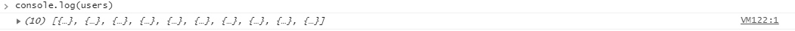
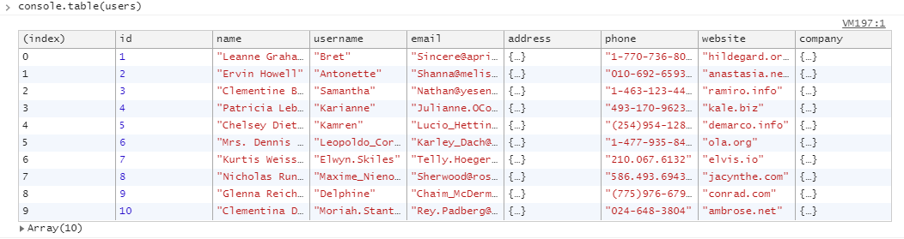
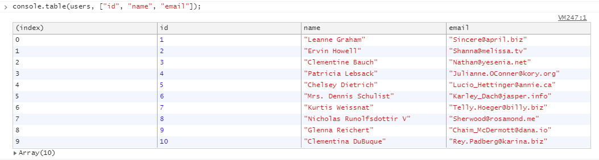

summary: View your logged messages and run JavaScript.
id: 3-console
categories: Debugging
tags: devtools
status: Published 
authors: Alberto López-Barranco
Feedback Link: https://github.com/albelop

# 3) Console panel
<!-- ------------------------ -->

## Introduction
Duration: 1

View your logged messages and run JavaScript.

### What You’ll Learn
- ✅ How to use different logging types
- ✅ Structure the logged data in tables
- ✅ Group logs and style them with CSS rules
- ✅ Use the Console panel as a REPL
- ✅ Some useful degugging commands from Utilities API

<!-- ------------------------ -->

## Logging

Let's explore the different types of logging messages in the Console, apart from the classic `console.log(msg)`.

### Warning & errors

```javascript
console.log('This is a normal message');

console.warn('This is a warning message');

console.error('This is an error!');

```

Negative
: **👁‍🗨 Try it yourself!**
Open the Console panel in DevTools and execute the lines above. Observe the different styling that each message gets.


### Tracing

If you need to know the stack of functions that led to the execution of a certain line/log, you can use `console.trace(msg)`.

```javascript
const loggingTrace = () => {
  const multiply = (a, b) => {
    console.trace(a * b);
  };

  multiply(5, 10);
};


logginTrace();

```

Negative
: **👁‍🗨 Try it yourself!**
Execute the code and expand the result to see the stack trace.

### Working with Arrays of Objects

The 




Positive
: **💡 Tip:** Use an array of keys as a second parameter for `console.table` to render only the given keys as columns.



<!-- ------------------------ -->

## Run JavaScript

<!-- ------------------------ -->

## Select elements

<!-- ------------------------ -->

## Monitoring

